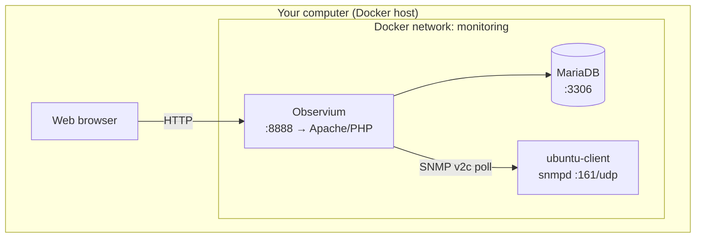

# Enterprise Infrastructure Monitoring Lab

A hands-on lab environment for learning **infrastructure monitoring** the way it is done in production networks: a central monitoring platform collects metrics from servers over **SNMP**, stores time-series data, and presents graphs in a web dashboard.

This repository packages everything into **Docker** so you can run the full lab on a laptop (macOS, Linux, or Windows with Docker Desktop) without installing separate virtual machines.

---

## Table of contents

1. [Overview](#overview)
2. [What you will learn](#what-you-will-learn)
3. [Architecture](#architecture)
4. [How monitoring works in this lab](#how-monitoring-works-in-this-lab)
5. [Prerequisites](#prerequisites)
6. [Installation](#installation)
7. [Daily use — starting the lab](#daily-use--starting-the-lab)
8. [Web interface guide](#web-interface-guide)
9. [Lab demonstrations](#lab-demonstrations)
10. [Scripts reference](#scripts-reference)
11. [Configuration reference](#configuration-reference)
12. [Manual operations](#manual-operations)
13. [Optional: monitor a Windows machine](#optional-monitor-a-windows-machine)
14. [Troubleshooting](#troubleshooting)
15. [Reset and teardown](#reset-and-teardown)
16. [Project structure](#project-structure)
17. [Security considerations](#security-considerations)
18. [References](#references)

---

## Overview

| Component | Technology | Role |
|-----------|------------|------|
| **Monitoring server** | [Observium](https://www.observium.org/) CE 24.12 (Docker) | Polls devices, stores metrics, serves web UI |
| **Database** | MariaDB 11.7 | Device inventory, configuration, alert metadata |
| **Monitored host** | Ubuntu 22.04 + `snmpd` | Exposes CPU, memory, disk, and network counters |
| **Orchestration** | Docker Compose | Single command to start/stop the entire lab |

**Default web UI:** [http://localhost:8888](http://localhost:8888)

**Default login:**

| Field | Value |
|-------|-------|
| Username | `admin` |
| Password | `observium` |

> The legal notice on the login page (“Unauthorised access…”) is standard Observium boilerplate, not an error.

---

## What you will learn

After completing this lab, you should understand:

- Why organizations use **centralized monitoring** instead of logging into each server manually
- How **SNMP** exposes host metrics (CPU, memory, storage, interfaces) in a vendor-neutral way
- The difference between **discovery** (finding what to monitor) and **polling** (collecting values on a schedule)
- How to correlate **load tests** (CPU stress, large downloads) with **graph changes** in Observium
- Basic operational tasks: add a device, verify SNMP, force a poll, read container logs

This maps directly to real-world tools (Observium, LibreNMS, PRTG, Zabbix, Datadog agents, etc.) that all follow the same pattern: **agent/exporter → collector → time-series store → dashboard**.

---

## Architecture

### Logical diagram



### Container details

| Service | Image / build | Host port | Internal hostname |
|---------|---------------|-----------|-------------------|
| `observium` | `mbixtech/observium:24.12` | `8888` → 80 | `observium` |
| `db` | `mariadb:11.7` | (none) | `db` |
| `ubuntu-client` | Built from `./client` | (none) | `ubuntu-client` |

Containers communicate on the private bridge network `monitoring`. Observium reaches the client by DNS name **`ubuntu-client`**, not `localhost`.

### Data persistence

| Host path | Contents |
|-----------|----------|
| `./data/mysql` | MariaDB database files |
| `./data/rrd` | RRD time-series files (graphs) |
| `./data/logs` | Observium and Apache logs |

These directories are created on first run and are listed in `.gitignore`.

---

## How monitoring works in this lab

### 1. SNMP agent (ubuntu-client)

The Ubuntu container runs **`snmpd`**, which answers read-only SNMP requests on UDP port 161. It exposes standard MIB trees:

| What you monitor | SNMP source | Typical OID tree |
|------------------|-------------|------------------|
| CPU utilization | HOST-RESOURCES-MIB | `hrProcessorLoad` |
| Memory & disk usage | HOST-RESOURCES-MIB | `hrStorage` |
| Network interfaces & traffic | IF-MIB | `ifDescr`, `ifInOctets`, `ifOutOctets` |
| System info | SNMPv2-MIB | `sysDescr`, `sysUpTime` |

Community string (password for SNMP v1/v2c): **`public`** by default (configurable in `.env`).

### 2. Discovery (Observium)

When a device is added, Observium runs **`discovery.php`**, which walks SNMP and registers:

- Processors, memory pools, storage volumes  
- Network ports and capabilities  
- Which graph types to create  

Discovery output in the terminal shows modules like `processors`, `mempools`, `storage`, `ports`.

### 3. Polling (Observium)

On a schedule (every **5 minutes** inside the container via `poller-wrapper.py`), Observium runs **`poller.php`**, which:

1. Queries SNMP counters on each device  
2. Writes values into **RRD** files under `./data/rrd`  
3. Updates the database with last-seen timestamps  

For demos, use `./scripts/poll-now.sh` to poll immediately instead of waiting for cron.

### 4. Presentation (web UI)

The PHP web front end reads RRD data and renders graphs under **Devices → &lt;hostname&gt;**.

---

## Prerequisites

| Requirement | Notes |
|-------------|-------|
| **Docker Desktop** (macOS/Windows) or **Docker Engine + Compose v2** (Linux) | Docker must be **running** before opening the UI |
| **~2 GB disk** | Images + database + RRD growth |
| **Port 8888 free** | Change `OBSERVIUM_PORT` in `.env` if occupied |
| **Internet** (first run only) | Pulls Docker images; demo download uses a public mirror |

No prior Observium experience required. Basic terminal and browser skills are enough.

---

## Installation

### First-time setup

```bash
cd /path/to/observium
cp .env.example .env          # optional: edit passwords, port, timezone
chmod +x scripts/*.sh
./scripts/setup.sh
```

`setup.sh` will:

1. Verify Docker is running  
2. Build the Ubuntu client image and start all containers  
3. Wait until the web UI responds  
4. Add **`ubuntu-client`** as an SNMP device and run discovery + poll  

First startup can take **2–5 minutes** while MariaDB initializes and Observium configures the schema.

### Verify installation

```bash
docker compose ps                    # three services, all "Up"
./scripts/verify-snmp.sh            # SNMP walk from Observium → client
curl -I http://localhost:8888       # HTTP/1.1 200 OK
```

---

## Daily use — starting the lab

After a reboot or quitting Docker Desktop, containers stop. The UI will show **connection refused** until you start again.

```bash
./scripts/start.sh
```

This script:

- Starts **Docker Desktop** on macOS if the daemon is down  
- Runs `docker compose up -d`  
- Waits until [http://localhost:8888](http://localhost:8888) responds  

Then log in with `admin` / `observium` and open **Devices → ubuntu-client**.

---

## Web interface guide

### Login

1. Open **http://localhost:8888** (use `http`, not `https`)  
2. Username: **`admin`**  
3. Password: **`observium`** (unless changed in `.env`)  

### Find your monitored server

| Navigation path | What you see |
|-----------------|--------------|
| **Devices** | List of all monitored hosts; `ubuntu-client` should appear |
| **Devices → ubuntu-client** | Device overview, status, graphs |
| **Devices → ubuntu-client → Health → Processor** | CPU load graphs |
| **Devices → ubuntu-client → Health → Memory** | Memory pool usage |
| **Devices → ubuntu-client → Health → Storage** | Disk/filesystem usage |
| **Devices → ubuntu-client → Ports** | Interface list and **Traffic** bit/s graphs |

### Understanding graph delays

- Automatic polling runs every **~5 minutes**  
- During a live demo, run **`./scripts/poll-now.sh`** in a terminal, then refresh the browser graph  
- RRD graphs show historical buckets; a single poll captures a snapshot for that interval  

---

## Lab demonstrations

These exercises match typical coursework or presentation requirements: prove that monitoring **detects real change**.

### Demo 1 — CPU load

**Goal:** Generate CPU load on the client and observe processor graphs rise.

**Terminal:**

```bash
# Default: 120 seconds, 4 CPU workers
./scripts/demo-cpu-load.sh

# Custom duration (seconds) and worker count
./scripts/demo-cpu-load.sh 60 2
```

**Browser:**

1. Open **Devices → ubuntu-client → Health → Processor**  
2. Start the script in another terminal  
3. While load is running: `./scripts/poll-now.sh`  
4. Refresh the page — CPU utilization should increase  

**What’s happening:** `stress-ng` burns CPU inside the `ubuntu-client` container. SNMP reports higher `hrProcessorLoad`. Observium’s poller writes new RRD samples.

---

### Demo 2 — Network traffic

**Goal:** Download a large file inside the client and watch inbound traffic on interface graphs.

**Terminal:**

```bash
# Default: ~100 MB from speedtest.tele2.net
./scripts/demo-network-traffic.sh

# Custom URL (e.g. 1 GB)
./scripts/demo-network-traffic.sh http://speedtest.tele2.net/1GB.zip
```

**Browser:**

1. Open **Devices → ubuntu-client → Ports**  
2. Identify the active interface (often `eth0`)  
3. Run the download script  
4. During download: `./scripts/poll-now.sh`  
5. Open **Traffic** graph for that port — **incoming** traffic should spike  

**What’s happening:** `curl` pulls data through the container’s network stack. IF-MIB counters (`ifInOctets`) increase; Observium graphs bits per second.

---

### Demo checklist (instructor / student)

| Step | Action | Expected result |
|------|--------|-----------------|
| 1 | `./scripts/start.sh` | UI loads at :8888 |
| 2 | Login | Dashboard visible |
| 3 | Devices → ubuntu-client | Device status **up** |
| 4 | `./scripts/demo-cpu-load.sh` + poll | Processor graph rises |
| 5 | `./scripts/demo-network-traffic.sh` + poll | Port traffic graph rises |
| 6 | `./scripts/verify-snmp.sh` | SNMP OIDs return data |

---

## Scripts reference

All scripts live in `scripts/` and should be run from the project root.

| Script | Purpose |
|--------|---------|
| **`setup.sh`** | First-time install: build, start, register `ubuntu-client` |
| **`start.sh`** | Daily startup: ensure Docker runs, `compose up`, wait for UI |
| **`add-devices.sh`** | Re-add `ubuntu-client` and run discovery + poll |
| **`poll-now.sh`** | Force `discovery.php` and `poller.php` on all devices |
| **`verify-snmp.sh`** | Test SNMP from Observium container (CPU, storage, interfaces) |
| **`demo-cpu-load.sh`** | Run `stress-ng` on ubuntu-client |
| **`demo-network-traffic.sh`** | Download a large file via `curl` on ubuntu-client |

### Examples

```bash
./scripts/start.sh
./scripts/poll-now.sh
./scripts/verify-snmp.sh
./scripts/demo-cpu-load.sh 90 4
docker compose logs -f observium
```

---

## Configuration reference

Copy `.env.example` to `.env` before first run (or let `setup.sh` create it).

| Variable | Default | Description |
|----------|---------|-------------|
| `COMPOSE_PROJECT_NAME` | `observium-lab` | Docker Compose project name (container name prefix) |
| `OBSERVIUM_PORT` | `8888` | Host port for web UI |
| `OBSERVIUM_BASE_URL` | `http://localhost:8888` | URL Observium uses for links (change if using another host/port) |
| `OBSERVIUM_ADMIN_USER` | `admin` | Initial admin username |
| `OBSERVIUM_ADMIN_PASS` | `observium` | Initial admin password |
| `MYSQL_ROOT_PASSWORD` | `observium` | MariaDB root password |
| `MYSQL_PASSWORD` | `observium` | MariaDB `observium` user password |
| `SNMP_COMMUNITY` | `public` | SNMP community on client and when adding devices |
| `TZ` | `UTC` | Timezone for logs and RRD timestamps (e.g. `America/Chicago`) |

> Changing `OBSERVIUM_ADMIN_*` after first boot may require resetting the database volume; for a clean slate see [Reset and teardown](#reset-and-teardown).

---

## Manual operations

### Add a device

```bash
docker compose exec observium \
  /opt/observium/add_device.php <hostname-or-ip> <community> v2c
```

Example (lab client):

```bash
docker compose exec observium \
  /opt/observium/add_device.php ubuntu-client public v2c
```

### Discovery and poll

```bash
# Discover metrics/modules for all devices
docker compose exec observium /opt/observium/discovery.php -h all

# Poll all devices (collect current values → RRD)
docker compose exec observium /opt/observium/poller.php -h all

# Poll one device
docker compose exec observium /opt/observium/poller.php -h ubuntu-client
```

> **Note:** Observium 24.x uses `poller.php`, not the older `poll_device.php`.

### SNMP test from Observium container

```bash
docker compose exec observium snmpwalk -v2c -c public ubuntu-client system
```

### Shell access

```bash
docker compose exec ubuntu-client bash    # client container
docker compose exec observium bash       # observium container
```

---

## Optional: monitor a Windows machine

The lab core is Docker-only. You can extend it with a **physical or VM Windows host** on your LAN.

### Enable SNMP on Windows 10/11

1. **Settings → Apps → Optional features → Add a feature**  
2. Install **Simple Network Management Protocol (SNMP)**  
3. **Services** → **SNMP Service** → **Properties**  
4. **Security** tab → add community `public`, rights **READ ONLY**  
5. Add your Docker host IP to **Accepted SNMP packets** (lab only; avoid `0.0.0.0` in production)  
6. Start the **SNMP Service**  

### Add Windows to Observium

Use an IP reachable from the Observium container:

```bash
docker compose exec observium \
  /opt/observium/add_device.php 192.168.1.100 public v2c

docker compose exec observium /opt/observium/discovery.php -h all
docker compose exec observium /opt/observium/poller.php -h all
```

On macOS, the host machine is often reachable as **`host.docker.internal`** from containers.

Windows exposes similar metrics via SNMP: processors, memory, logical disks, and network adapters.

---

## Troubleshooting

### `ERR_CONNECTION_REFUSED` on localhost:8888

**Cause:** Docker is not running, or containers are stopped.

```bash
./scripts/start.sh
docker compose ps
```

Ensure all three services show **Up**. Wait 30–60 seconds after Docker starts.

---

### Login fails / wrong password

- Default: `admin` / `observium`  
- Check `.env` for `OBSERVIUM_ADMIN_USER` and `OBSERVIUM_ADMIN_PASS`  
- If you changed credentials after first install, reset data:

  ```bash
  docker compose down
  rm -rf data/
  ./scripts/setup.sh
  ```

---

### Device `ubuntu-client` down or no graphs

```bash
./scripts/verify-snmp.sh
```

| Check | Command |
|-------|---------|
| Client running? | `docker compose ps ubuntu-client` |
| SNMP community matches? | Compare `.env` `SNMP_COMMUNITY` with `client/snmpd.conf` |
| Re-register device | `./scripts/add-devices.sh` |
| Force poll | `./scripts/poll-now.sh` |

---

### `poll_device.php: no such file or directory`

Observium 24.12 renamed/removed that script. Use:

```bash
docker compose exec observium /opt/observium/poller.php -h all
```

All lab scripts already use `poller.php`.

---

### Observium slow on first start

MariaDB initialization and Observium schema setup can take 1–2 minutes. Watch logs:

```bash
docker compose logs -f observium
docker compose logs -f db
```

---

### Port 8888 already in use

Edit `.env`:

```env
OBSERVIUM_PORT=9080
OBSERVIUM_BASE_URL=http://localhost:9080
```

Then:

```bash
docker compose down
docker compose up -d
```

Open **http://localhost:9080**.

---

### Demo download fails (network traffic script)

- Confirm the client has internet:  
  `docker compose exec ubuntu-client curl -I https://example.com`  
- Try another URL as the script argument  
- Corporate proxies may block outbound HTTP from containers  

---

## Reset and teardown

### Stop containers (keep data)

```bash
docker compose down
```

### Full reset (delete database and graphs)

```bash
docker compose down
rm -rf data/
./scripts/setup.sh
```

### Remove images (optional)

```bash
docker compose down --rmi local
docker rmi mbixtech/observium:24.12 mariadb:11.7 2>/dev/null || true
```

---

## Project structure

```
observium/
├── README.md                 # This file
├── docker-compose.yml        # Stack definition (3 services)
├── .env.example              # Configuration template
├── .env                      # Local config (gitignored; created on setup)
├── .gitignore
│
├── client/                   # Ubuntu SNMP client image
│   ├── Dockerfile            # Ubuntu 22.04 + snmpd + stress-ng + curl
│   ├── snmpd.conf            # SNMP agent configuration
│   └── entrypoint.sh         # Starts snmpd with community from .env
│
├── scripts/
│   ├── setup.sh              # First-time bootstrap
│   ├── start.sh              # Start Docker + containers + wait for UI
│   ├── add-devices.sh        # Register ubuntu-client in Observium
│   ├── poll-now.sh           # Force discovery + poll
│   ├── verify-snmp.sh        # SNMP connectivity test
│   ├── demo-cpu-load.sh      # CPU stress demo
│   └── demo-network-traffic.sh
│
└── data/                     # Created at runtime (gitignored)
    ├── mysql/                # MariaDB data directory
    ├── rrd/                  # Graph time-series files
    └── logs/                 # Observium / poller / Apache logs
```

---

## Security considerations

This lab prioritizes **ease of use over security**. Do not deploy it as-is on the public internet.

| Risk | Lab default | Recommendation |
|------|-------------|----------------|
| Web UI password | Weak (`observium`) | Change in `.env` before shared use |
| SNMP community | `public` (world-readable) | Use a unique community; restrict by source IP |
| Exposed port | `8888` on localhost | Do not port-forward to WAN without hardening |
| Windows SNMP | Optional | Restrict accepted hosts to Observium IP only |

For production monitoring, use SNMPv3, TLS, VPNs, strong authentication, and network segmentation.

---

## References

| Resource | URL |
|----------|-----|
| Observium | https://www.observium.org/ |
| Observium documentation | https://docs.observium.org/ |
| SNMP overview | https://en.wikipedia.org/wiki/Simple_Network_Management_Protocol |
| HOST-RESOURCES-MIB | CPU, memory, storage on hosts |
| IF-MIB | Network interface statistics |
| Docker Compose | https://docs.docker.com/compose/ |

---

## License and disclaimer

Observium Community Edition is distributed under the **QPL** open-source license. Docker images used in this lab are maintained by third parties (`mbixtech/observium`, official MariaDB image).

This repository is an **educational wrapper** around those components—not affiliated with Observium Ltd.

---

**Quick reference**

```bash
./scripts/setup.sh      # first time
./scripts/start.sh      # every day
# → http://localhost:8888  (admin / observium)
./scripts/demo-cpu-load.sh
./scripts/demo-network-traffic.sh
./scripts/poll-now.sh
```
